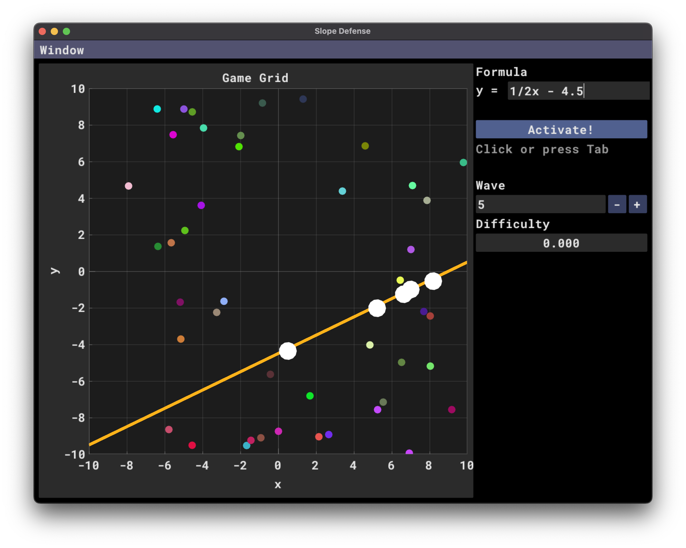

# Slope Defense

A simple game where you attempt to pop bubbles by entering a mathematical formula for a function which intersects as many bubbles as possible.

## Building

On macOS or Linux, run:

        % git clone https://github.com/jminor/slope-defense.git
        % cd slope-defense
        % ./build.sh
        % ./build/slope_defense

## Thanks!

This game was built using these amazingly helpful libraries:
- [exprtk](https://github.com/ArashPartow/exprtk.git)
- [mahi-gui](https://github.com/mahilab/mahi-gui.git)
- [Dear ImGui](https://github.com/ocornut/imgui)
- [ImPlot](https://github.com/epezent/implot)
- [GLFW](https://www.glfw.org/)

